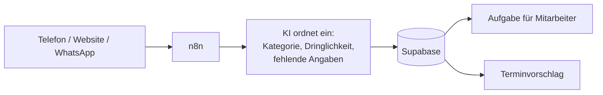

# AI Receptionist für Handwerksbetriebe, n8n-Prototyp

Ein Lernprojekt: n8n nimmt Kundenanfragen per Telefon, Website und WhatsApp an, lässt sie von einer KI einordnen und legt sie für Mitarbeiter in einer Datenbank ab.

> Prototyp. Getestet nur mit erfundenen Testdaten, nicht im echten Einsatz.

## Worum es geht

In kleinen Handwerksbetrieben gehen Anrufe und Nachrichten oft unter, weil alle auf der Baustelle sind. Ich wollte ausprobieren, wie weit man die Annahme einer Anfrage automatisieren kann, bevor ein Mensch übernimmt. Als Beispiel habe ich einen Sanitär- und Heizungsbetrieb genommen.

## Ablauf

Ein Telefonassistent (Vapi) oder ein Formular nimmt die Anfrage auf. n8n bereitet die Daten auf, eine KI ordnet das Anliegen ein, und am Ende liegt eine Aufgabe in der Datenbank. Notfälle wie ein Rohrbruch werden markiert. Für einfache Aufträge wie Wartungen kann das System freie Termine vorschlagen.

Die KI sieht dabei keine Namen, Telefonnummern oder Adressen, nur das Anliegen selbst. Was sie zurückgibt, prüfen feste Regeln, damit keine Preise oder Terminzusagen beim Kunden landen.

## Screenshots

Hauptworkflow:

Terminassistent (Unterworkflow):

## Technik

n8n, Vapi (Voice AI), OpenAI, Supabase, Twilio (nur WhatsApp-Test), Webhooks und REST-APIs.
Beim Bauen haben mir Claude Code und ChatGPT viel geholfen, vor allem beim JavaScript und SQL.

## Was ich gelernt habe

- Mehrere Eingänge, Verzweigungen und einen Unterworkflow in n8n zu einem Ablauf zusammenbringen
- Webhooks kommen manchmal doppelt an. Das fange ich jetzt über die Datenbank ab.
- KI-Ergebnissen nicht blind vertrauen, sondern sie mit festen Regeln gegenprüfen
- Viele Fehler zeigen sich erst im echten Testlauf, z. B. ein Ortsvergleich, der an „ue“ statt „ü“ gescheitert ist

## Stand

Läuft mit Testdaten. E-Mail- und WhatsApp-Versand sind vorbereitet, aber ausgeschaltet.

Mehr Details: [docs/](docs/workflow-details.md) · Workflows (bereinigt, ohne Zugangsdaten): [workflows/](workflows/)
