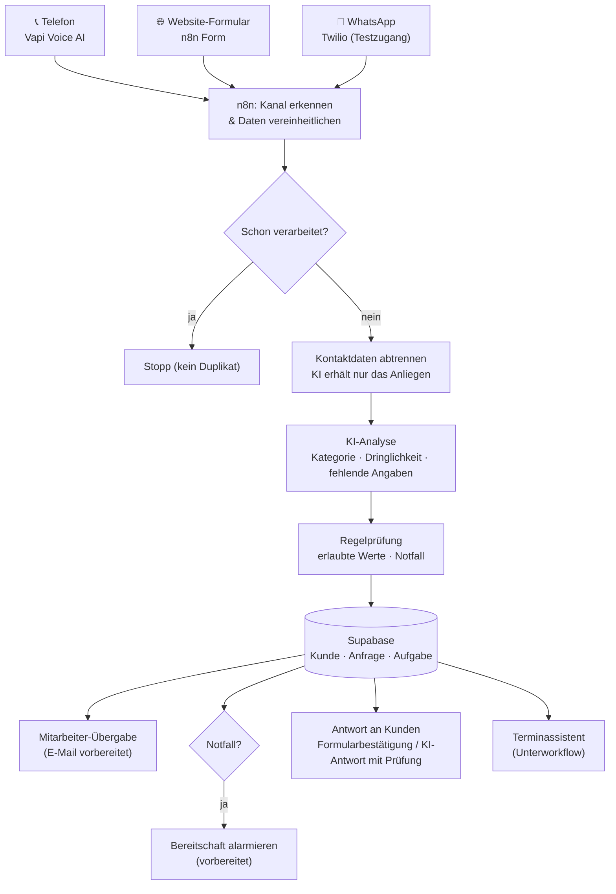
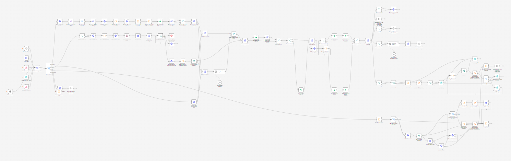
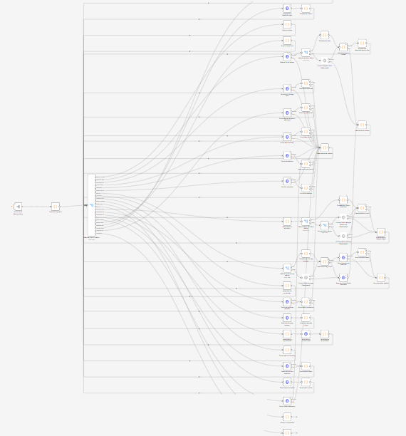

# AI Receptionist für Handwerksbetriebe, n8n-Prototyp

Ein n8n-System, das Kundenanfragen per Telefon, Website-Formular und WhatsApp entgegennimmt, mit KI auswertet, in einer Datenbank speichert und für Mitarbeitende zur Bearbeitung vorbereitet.

> **Status: Prototyp / persönliches Lernprojekt.**
> Ich habe das System selbstständig gebaut und mit erfundenen Testdaten getestet, nicht mit echten Kunden. Es ist kein fertiges Produkt und läuft in keinem Betrieb.

---

## Das Problem

Ich habe mir einen kleinen Sanitär- und Heizungsbetrieb (SHK) als Beispiel genommen. Dort kommen Anfragen über verschiedene Kanäle: Anrufe, Website und WhatsApp. Oft kommen sie dann, wenn gerade niemand Zeit hat. Jemand muss jede Anfrage lesen, wichtige Angaben nachfragen, die Dringlichkeit einschätzen und sie an die richtige Person weitergeben. Das kostet Zeit, und Notfälle wie ein Rohrbruch können zwischen normalen Anfragen untergehen.

## Meine Lösung

Das System übernimmt die wiederkehrenden Schritte bis zur Übergabe an einen Menschen:

1. **Anfrage annehmen**: Ein Voice-AI-Telefonassistent (Vapi) nimmt Anrufe an. Dazu gibt es ein Website-Formular und einen WhatsApp-Testzugang über Twilio.
2. **Verstehen und einordnen**: Eine KI liest das Anliegen. Sie bestimmt die Kategorie (z. B. Heizungsstörung, Wasserschaden, Wartung) und die Dringlichkeit. Sie erfasst Gerät, Hersteller und Fehlercode und notiert, welche Angaben noch fehlen.
3. **Speichern**: Kunde, Anfrage und eine offene Aufgabe für Mitarbeitende werden in Supabase gespeichert.
4. **Übergeben**: Eine fertig formatierte Mitarbeiter-Mail wird vorbereitet. Notfälle sind dort deutlich markiert.
5. **Termine (Zusatzmodul)**: Für einfache, planbare Aufträge wie Wartungen kann ein Terminassistent freie Termine vorschlagen und buchen. Für den Test nutzt er einen Testkalender.

Entscheidungen mit Risiko bleiben bei Menschen. Die KI nennt keine Preise, stellt keine Diagnosen und sagt keinen Termin zu, den das System nicht wirklich gebucht hat.

## Ablauf

```
Kundenanfrage (Telefon · Website · WhatsApp)
        ↓
Voice-Assistent / Formular / Nachricht
        ↓
n8n: Eingang erkennen, Duplikate abfangen, Daten vereinheitlichen
        ↓
KI-Analyse: Kategorie, Dringlichkeit, Gerät, fehlende Angaben
        ↓
Regelprüfung (erlaubte Werte, Notfallerkennung)
        ↓
Supabase: Kunde · Anfrage · Mitarbeiteraufgabe
        ↓
Übergabe an Mitarbeitende (+ optional Terminvorschlag)
```



## Screenshots

**Hauptworkflow in n8n:** drei Eingangskanäle, KI-Analyse, Speicherung und Übergabe.


**Terminassistent (Unterworkflow):** Terminvorschläge, Reservierung, Buchung und Übergabe an Mitarbeitende.


## Die wichtigsten Workflow-Teile

| Teil | Was passiert |
|---|---|
| **Anfrage erfassen** | Drei Eingänge laufen in denselben Ablauf: Vapi-Webhook (Telefon), n8n-Formular (Website) und Twilio-Abruf alle 10 Minuten (WhatsApp). Jeder Kanal wird in dasselbe Datenformat übersetzt. WhatsApp-Nachrichten derselben Nummer werden gebündelt. |
| **Doppelte Eingänge abfangen** | Jeder Eingang wird mit seiner technischen ID in einer Tabelle vermerkt. Kommt derselbe Anruf oder dieselbe Nachricht noch einmal, wird er nicht doppelt verarbeitet. |
| **Anfrage klassifizieren** | Ein OpenAI-Modell liest nur den Text des Anliegens, ohne Name, Telefonnummer und Adresse. Es gibt feste Felder zurück: Kategorie, Dringlichkeit, Hersteller, Gerät, Fehlercode, Warmwasser und fehlende Angaben. Bei Telefonanrufen liefert Vapi diese Auswertung schon selbst. |
| **Ergebnis absichern** | Nach der KI prüfen feste Regeln das Ergebnis: Nur erlaubte Kategorien zählen, ein Wasserschaden wird immer als Notfall markiert, und ausdrücklich verneinte Gefahren („kein Gasgeruch“) lösen keinen Notfall aus. |
| **In Supabase speichern** | Das System sucht den Kunden über die Telefonnummer oder legt ihn neu an. Danach speichert es die Anfrage oder ergänzt eine bestehende und legt eine offene Aufgabe „Anfrage prüfen“ an. |
| **Mitarbeiterübergabe vorbereiten** | Erst wenn alles gespeichert ist, geht es weiter. Das System erstellt eine übersichtliche E-Mail mit Rückrufnummer, Anliegen, Kategorie und fehlenden Angaben. Notfälle sind rot markiert. Der Versand ist vorbereitet, aber deaktiviert. |
| **Kunden antworten** | Website-Kunden sehen eine Bestätigung. Für WhatsApp formuliert eine KI eine kurze Antwort. Eine Prüfung ersetzt sie durch einen Standardtext, wenn sie Uhrzeiten, Preise, Zusagen oder Kontaktdaten enthält. Der Versand ist im Prototyp deaktiviert. |
| **Telefonassistent (Vapi)** | Der Voice-Assistent führt das Gespräch nach einem eigenen Systemprompt ([prompts/](prompts/)). Während des Anrufs kann er über zwei Werkzeuge freie Termine abfragen und buchen. Nach dem Anruf schickt er einen strukturierten Bericht an n8n. |
| **Terminassistent** | Ein eigener Unterworkflow berechnet Terminvorschläge nach Öffnungszeiten, Puffern und Einsatzgebiet. Er reserviert und bucht Termine und kann sie verschieben oder stornieren. Die Datenbank verhindert Doppelbuchungen. Passt kein Termin, entsteht eine Aufgabe für Mitarbeitende. |
| **Fehlerfall** | Bricht ein Workflow ab, wird ein Fehleralarm vorbereitet. Ein Prüf-Trigger zeigt vor dem Start, welche Einstellungen noch fehlen. |

Mehr Details: [docs/workflow-details.md](docs/workflow-details.md) · Datenbank: [docs/datenmodell.md](docs/datenmodell.md)

## Technologien

| Werkzeug | Wofür ich es genutzt habe |
|---|---|
| **n8n** (Cloud) | Zentrale Steuerung aller Abläufe: Webhooks, Formulare, Verzweigungen, Code-Nodes (JavaScript), Unterworkflow |
| **Vapi** | Voice-AI-Telefonassistent mit eigenem Systemprompt, Werkzeugaufrufen und strukturiertem Gesprächsbericht |
| **OpenAI-Modelle** (über n8n) | Klassifizierung der Anliegen und Entwurf der WhatsApp-Antworten |
| **Supabase** (PostgreSQL) | Speicherung von Kunden, Anfragen, Aufgaben, Eingängen und Terminen; Zugriff über n8n-Nodes und die REST-API |
| **Twilio** | WhatsApp-Testzugang (nur für Demo und Test) |
| **Webhooks & REST-APIs** | Verbindung zwischen Vapi, n8n, Twilio und Supabase |
| **Microsoft Outlook** (n8n-Node) | E-Mail an Mitarbeitende, vorbereitet und deaktiviert |
| **Claude Code & ChatGPT** | Hilfe beim Bauen: Code-Nodes, SQL, Prompts, Fehlersuche und Tests |

## Wie ich gearbeitet habe

Ich bin kein ausgebildeter Entwickler. Ich habe mir n8n und die anderen Werkzeuge selbst beigebracht, mit dem Ziel, einen echten Geschäftsablauf von Anfang bis Ende zu automatisieren. Angefangen habe ich im August 2026 mit einem kleinen Übungs-Workflow, der Aufträge nach Priorität sortiert. Danach habe ich das System Schritt für Schritt erweitert.

Den Ablauf, die Regeln und die Testfälle habe ich selbst festgelegt. Dazu gehört zum Beispiel, wann etwas ein Notfall ist, welche Daten die KI sehen darf und was ein Mitarbeitender bekommen soll. Beim Schreiben von JavaScript, SQL und Prompts habe ich viel mit KI-Werkzeugen gearbeitet, vor allem mit Claude Code. Jede Änderung habe ich mit Testdaten in n8n und Supabase geprüft.

## Was ich dabei gelernt habe

- **n8n-Workflow-Logik:** Trigger, Merge, Switch und If, Unterworkflows, Fehler-Trigger, und wie Daten von Node zu Node weitergegeben werden.
- **Bedingungen und Verzweigungen:** Ein Ablauf für drei Kanäle mit unterschiedlichen Daten. Dazu getrennte Wege für Notfall, Ergänzung zu einer bestehenden Anfrage und Terminbuchung.
- **Webhooks und Datenübertragung:** Vapi ruft n8n während und nach dem Anruf auf. n8n ruft die REST-APIs von Supabase, Twilio und Vapi auf. Ich habe gelernt, Antwortformate genau zu lesen.
- **Supabase und Datenbanken:** Tabellen, Beziehungen, eindeutige Schlüssel und eine Datenbankregel gegen überlappende Termine. Ich weiß jetzt auch, warum ein Webhook, der zweimal ankommt, sonst doppelte Datensätze erzeugt.
- **Fehleranalyse:** Viele Fehler sieht man erst im echten Durchlauf. Ein Beispiel: Ein n8n-Formular startet nicht mehr, sobald irgendwo im Workflow ein bestimmter Antwort-Node existiert. In Tests mit gespeicherten Beispieldaten fiel das nicht auf. Ein anderes Beispiel: Ein Ortsvergleich scheiterte an Umlauten („ue“ statt „ü“).
- **Prompting:** Prompts für den Telefonassistenten und die Klassifizierung. Dabei geht es vor allem um Grenzen: keine Preise, keine erfundenen Termine, Verneinungen wie „es riecht nicht nach Gas“ richtig verstehen.
- **LLM-Integration mit Leitplanken:** Die KI ist hilfreich, aber nicht immer zuverlässig. Deshalb prüfen feste Regeln ihre Ergebnisse, und bei einem KI-Ausfall greift ein Standardtext.
- **Datenschutz im Ablauf:** Name, Telefonnummer und Adresse werden vor dem KI-Aufruf abgetrennt und erst danach wieder zusammengeführt.
- **Mehrere Systeme zu einem Prozess verbinden:** Wenn ein Schritt ausfällt, darf keine Anfrage verloren gehen und keine doppelt ankommen.

## Status und Grenzen

**Prototyp / Lernprojekt.** Konkret heißt das:

- Getestet habe ich nur mit erfundenen Testdaten und einem Testkalender, nicht im echten Betrieb.
- Der Versand von E-Mails, WhatsApp-Antworten und Notfall-Alarmen ist vorbereitet, aber deaktiviert.
- WhatsApp läuft nur über einen Twilio-Testzugang. Für echten Einsatz wäre die offizielle WhatsApp Business API nötig.
- Ein Mitarbeiter-Dashboard gibt es nicht. Die Aufgaben liegen nur in der Datenbank.
- Einige Punkte sind bewusst offen, z. B. eine Absicherung des Vapi-Bericht-Webhooks und die Anbindung eines echten Kalenders (Outlook).

## Inhalt dieses Repositorys

```
workflows/   bereinigte n8n-Workflows (JSON, in n8n importierbar)
prompts/     Systemprompt des Vapi-Telefonassistenten
supabase/    SQL-Migrationen für Terminverwaltung und Duplikatschutz
docs/        Ablauf im Detail und Datenmodell
screenshots/ Bilder der Workflows
```

Alle Zugangsdaten, IDs, URLs und Telefonnummern wurden vor der Veröffentlichung durch Platzhalter ersetzt (z. B. `YOUR_PROJECT.supabase.co`, `YOUR_CREDENTIAL_ID`). Hinweise zum Import stehen in [workflows/README.md](workflows/README.md).

---

*Persönliches Lernprojekt von Eren Altay, 2026.*
