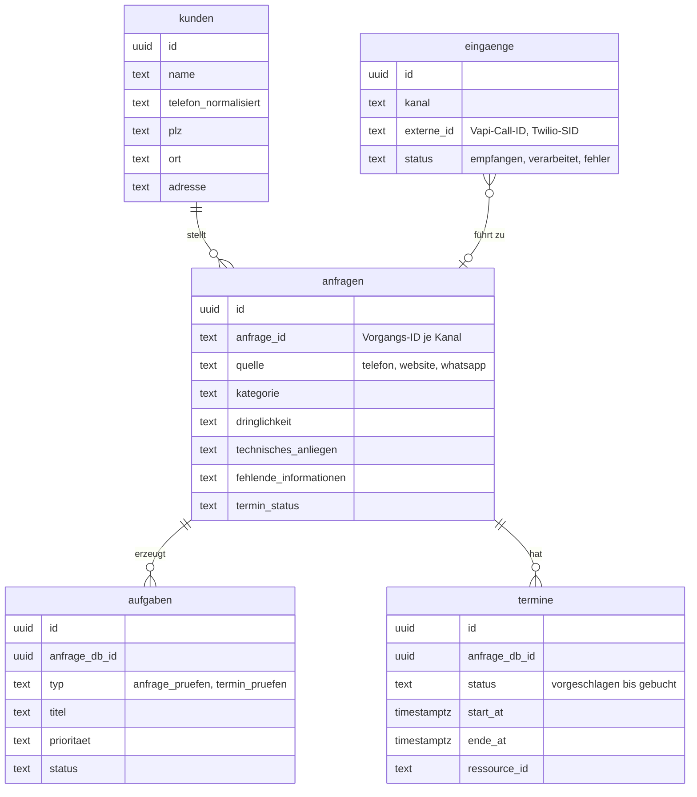

# Datenmodell (Supabase / PostgreSQL)

Alle Tabellen haben eine Spalte `betrieb_id`. So könnte dieselbe Datenbank später mehrere Betriebe getrennt verwalten.

| Tabelle | Zweck |
|---|---|
| `kunden` | Ein Eintrag je Kunde und Betrieb. Gefunden wird der Kunde über die normalisierte Telefonnummer. |
| `anfragen` | Ein Eintrag je Vorgang mit KI-Auswertung und Terminstatus. Eindeutig über (`betrieb_id`, `anfrage_id`), damit ein Anruf nie doppelt gespeichert wird. |
| `aufgaben` | Offene Arbeit für Mitarbeitende. Pro Anfrage gibt es höchstens eine Aufgabe je Typ. |
| `termine` | Vorschläge, Reservierungen und Buchungen. Eine Datenbankregel (`exclude using gist`) verhindert Überschneidungen derselben Ressource, inklusive Puffer. |
| `eingaenge` | Protokoll der technischen Eingangs-IDs ohne personenbezogene Daten. Es verhindert, dass ein Anruf oder eine Nachricht doppelt verarbeitet wird. |

Die SQL-Dateien für `termine` und den Duplikatschutz liegen in [`supabase/`](../supabase/). Für die Grundtabellen `kunden`, `anfragen`, `aufgaben` und `eingaenge` liegt hier keine SQL-Datei bei. Die Spalten oben habe ich aus den Workflows abgeleitet und auf die wichtigsten gekürzt.
